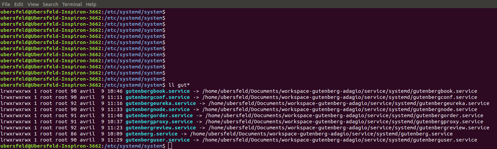
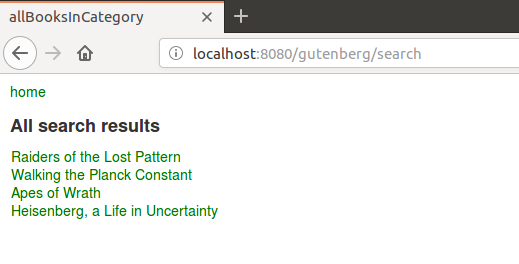

# gutenberg-adagio
I present here a microservice-oriented application that is a spin-off of the previous project [gutenberg-allegro](https://github.com/dubersfeld/gutenberg-allegro). This project uses an ElasticSearch Docker image instead of the local ElasticSearch service that should be stopped to avoid any port conflict. The main difference is that the application is started using systemd instead of Docker-Compose.
 
Here are the prerequisites for running the complete application:

A recent Linux version that supports systemd (I used Ubuntu 18.04)
A recent Docker version installed (I used 17.12.0-ce)
A recent Apache Maven version installed (I used 3.3.9)
An HTTP tool like Postman or equivalent. 

In addition I used Spring Tool Suite for developing this demo but it is not required for running the application.

# 1 Basic application

Here is the list of all 9 containers:

Server            | Image                                               | Port | Function             | Database connection
---------------   | ----------------------------------------------------| ---- | -------------------  | -------------------
elastic-books     | docker.elastic.co/elasticsearch/elasticsearch:6.6.1 | 9200 | Schemaless database  | 
config-server     | gutenberg/config-server                             | 8888 | Configuration server | None
eurekaserver      | gutenberg/eureka-service                            | 8761 | Discovery server     | None
book-service      | gutenberg/book-server                               | 8081 | Book requests        | gutenberg-books
review-service    | gutenberg/review-server                             | 8082 | Review requests      | gutenberg-reviews
order-service     | gutenberg/order-server                              | 8083 | Order requests       | gutenberg-orders
user-service      | gutenberg/user-server                               | 8084 | User requests        | gutenberg-requests
zuul-service      | gutenberg/zuul-server                               | 5555 | Gateway              | None
frontend-service  | gutenberg/frontend-server                           | 8080 | frontend             | None

A volume is used for persistence.
 
A gateway is used to hide some Spring servers. Here is the list:

Server           | Port | Gateway URI
---------------- | ---- | -------------------------
book-service     | 8081 | zuul-service:5555/books
review-service   | 8082 | zuul-service:5555/reviews
order-service    | 8083 | zuul-service:5555/orders
user-service     | 8084 | zuul-service:5555/users

Here are the steps to run the application:

## 1.1 Images creation

In subdirectory gutenberg-adagio/service run the bash script build_spring.

```
#!/bin/bash
# filename build_spring

for server in 'book-server' 'config-server' 'order-server' 'review-server' 'user-server' 'eureka-service' 'zuul-server' 'frontend-server'
do 
    cd ../$server
    pwd
    ./build.sh

    echo $?
    if [ "$?" -ne 0 ]
    then 
      echo "Build failed for $server"
      exit "$?"
    fi 
done
```

This will create the 8 Spring images. The remaining non Spring image will be pulled from a Docker repository.

## 1.2 Systemd files creation

Create symbolic links from directory /etc/systemd/system to subdirectory gutenberg-adagio/service/systemd

```
sudo ln -s <your path>/gutenberg-adagio/service/systemd/gutenbergbook.service /etc/systemd/system/gutenbergbook.service
sudo ln -s <your path>/gutenberg-adagio/service/systemd/gutenbergconf.service /etc/systemd/system/gutenbergconf.service
sudo ln -s <your path>/gutenberg-adagio/service/systemd/gutenbergeureka.service /etc/systemd/system/gutenbergeureka.service
sudo ln -s <your path>/gutenberg-adagio/service/systemd/gutenbergnode.service /etc/systemd/system/gutenbergnode.service
sudo ln -s <your path>/gutenberg-adagio/service/systemd/gutenbergorder.service /etc/systemd/system/gutenbergorder.service
sudo ln -s <your path>/gutenberg-adagio/service/systemd/gutenbergproxy.service /etc/systemd/system/gutenbergproxy.service
sudo ln -s <your path>/gutenberg-adagio/service/systemd/gutenbergreview.service /etc/systemd/system/gutenbergreview.service
sudo ln -s <your path>/gutenberg-adagio/service/systemd/gutenberg.service /etc/systemd/system/gutenberg.service
sudo ln -s <your path>/gutenberg-adagio/service/systemd/gutenberguser.service /etc/systemd/system/gutenberguser.service
```

Then if you run the command `ls -l gutenberg*` in directory /etc/systemd/system the response should look like:



Here is the main systemd file name gutenberg.service:

```
# filename gutenberg.service
[Unit]
Description=Simple Docker ElasticsSearch Application
After=network.target
After=docker.service
After=gutenbergproxy.service
After=gutenbergbook.service
After=gutenbergreview.service
After=gutenbergorder.service
After=gutenberguser.service
Requires=docker.service
Requires=gutenbergproxy.service
Requires=gutenbergbook.service
Requires=gutenbergreview.service
Requires=gutenbergorder.service
Requires=gutenberguser.service

[Service]
# edit to match your own filesystem
Environment="BASHDIR=/home/ubersfeld/Documents/gutenberg-adagio/service"
# edit to match your own username
User=ubersfeld
ExecStart=/bin/bash -c 'cd $BASHDIR ; ./startFrontend.sh'
ExecStop=/bin/bash -c 'cd $BASHDIR ; ./stopGutenberg.sh'

[Install]
WantedBy=multi-user.target
```

It requires for example the service gutenbergbook.service that itself requires services gutenbergnode, gutenbergeureka and gutenbergconf. In this way the main service starts only if all ancillary services start.

```
# filename gutenbergbook.service
[Unit]
Description=Simple Docker RESTful Server
After=network.target
After=docker.service
After=gutenbergconf.service
After=gutenbergnode.service
After=gutenbergeureka.service
Requires=docker.service
Requires=gutenbergnode.service
Requires=gutenbergeureka.service
Requires=gutenbergconf.service

[Service]
# edit path to match your own filesystem
Environment="BASHDIR=/home/ubersfeld/Documents/gutenberg-adagio/service"
# edit to match your own username
User=ubersfeld
ExecStart=/bin/bash -c 'cd $BASHDIR ; ./startBook.sh'
ExecStop=/bin/bash -c 'cd $BASHDIR ; ./stopBook.sh'

[Install]
WantedBy=multi-user.target
```

The file gutenbergnode.service contains two ExecStartPre clauses that create a network named gutenberg and a volume named gutenberg if they don't exist yet. 

```
# filename gutenbergnode.service
[Unit]
Description=Simple Docker ElasticsSearch Application
After=network.target
After=docker.service
Requires=docker.service

[Service]
# edit to match your own username
User=ubersfeld
# edit path to match your own filesystem
Environment="BASHDIR=/home/ubersfeld/Documents/gutenberg-adagio/service"
ExecStartPre=-/bin/bash -c 'cd $BASHDIR ; ./createNetwork.sh'
ExecStartPre=-/bin/bash -c 'cd $BASHDIR ; ./createVolume.sh'
ExecStart=/bin/bash -c 'cd $BASHDIR ; ./startNode.sh'
ExecStop=/bin/bash -c 'cd $BASHDIR  ; ./stopNode.sh'

[Install]
WantedBy=multi-user.target
```

Note the environment variables BASHDIR and CONFIGREPO that should be edited according to your filepath.

## 1.2 Running the application

### 1.2.1 Setting vm.max_map_count
Add the line: `vm.max\_map\_count=262144`
to the file /etc/sysctl.conf
Note: rebooting may be needed.


### 1.2.2 Starting the application as a service
To start the application as a service run the command:

systemctl start gutenberg

Check the status by running the command `systemctl status gutenberg`. The response should look like:

```
● gutenberg.service - Simple Docker ElasticsSearch Application
   Loaded: loaded (/home/ubersfeld/Documents/workspace-gutenberg-adagio/service/systemd/gutenberg.service; lin
   Active: active (running) since Tue 2019-04-09 11:41:44 CEST; 31min ago
 Main PID: 2186 (bash)
    Tasks: 14 (limit: 4915)
   CGroup: /system.slice/gutenberg.service
           ├─2186 /bin/bash -c cd /home/ubersfeld/Documents/workspace-gutenberg-adagio/service ; ./startFronte
           ├─2195 /bin/bash ./startFrontend.sh
           └─2196 docker run --name frontend-server -p 8080:8080 --network gutenberg -e GUTENBERG_CONFIG_URI=h

```

To stop the service run the command:
```
systemctl stop gutenberg
```

Note that this command calls a bash script that kills all containers frome this service:

```
#!/bin/bash
# filename stopGutenberg.sh

# find if any gutenberg container exists, if yes remove it

input=`docker ps -a | grep gutenberg`
echo "$input"

IFS=$'\n'

lines=($input)

echo "${#lines[@]}"

IFS=$' ,\t,\n'
for line in "${lines[@]}"
do
    container=($line) 
  
    echo "Container ID ${container[0]}"
    docker rm -f  "${container[0]}"
done
```


To make the service automatically starting when the machine boots run the command:
```
systemctl enable gutenberg
```


All running Spring containers can be seen on Eureka port 8761.

The frontend itself is accessed on URL localhost:8080/gutenberg. A username and password are required. Here are the prepopulated users:

Username | Password
-------- | --------- 
Carol    | s1a2t3o4r 
Albert   | a5r6e7p8o
Werner   | t4e3n2e1t
Alice    | o8p7e6r5a
Richard  | r1o2t3a4s
Sator    | sator1234 
Arepo    | arepo1234
Tenet    | tenet1234
Opera    | opera1234
Rotas    | rotas1234

### 1.2.2 Populating the ElacsticSearch indices

Once the servers have started go to service/elasticsearch folder and run the commands:
```
./createBooks.sh
./createUsers.sh
./createReviews.sh
./createOrders.sh
```
It creates all prepopulated indices.

To stop the application run the command:

```
systemctl stop gutenberg
```

Here is a snapshot of the welcome page:


## 1.3 Searching for a book

Enter one or several keywords in the keywords field. Note that gutenberg-books index is searched for matches in three distinct fields: "title", "description", "tags"

Here is a snapshot of the search results for keywords "gorilla quantum pattern captain":



## 1.4 Registering a new user

Click on register on Login page then fill the registration form. The username should not be already present in gutenberg-users  index. Once registered the new user can connect to frontend server.

## 1.5 Using admin-service
To access admin-service the best way is to use Postman or any similar application. The URI is localhost:9090/admin.

Here are two snapshots of Postman interaction:


